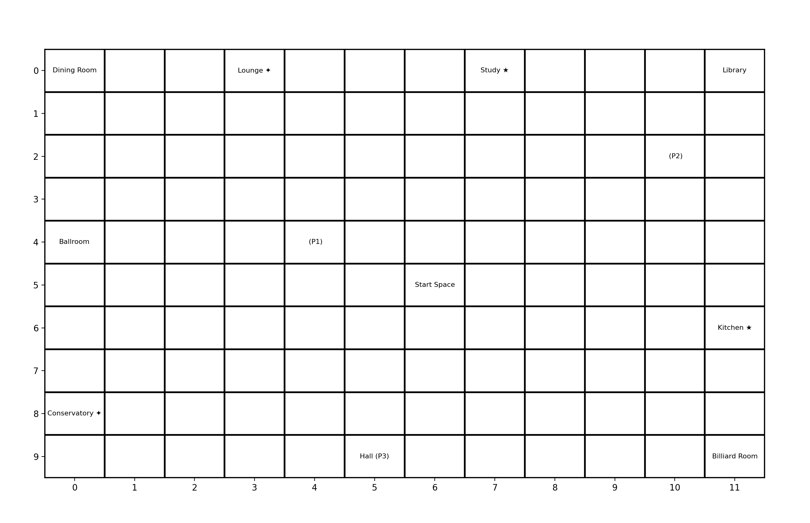

# Cluedo Project

## Table of Contents

- [Introduction](#introduction)
- [Features](#features)
- [Installation](#installation)
- [Usage](#usage)
- [Game Rules](#game-rules)
- [Technologies Used](#technologies-used)
- [Project Structure](#project-structure)
- [Contributing](#contributing)
- [License](#license)

## Introduction

The Cluedo Project is a digital version of the classic mystery board game *Cluedo* (also known as *Clue*). The objective of the game is for players to determine the details of a murder: who committed it, with what weapon, and in which room. Players move across a grid representing a mansion, gather clues, make suggestions, and ultimately try to make the correct accusation to win the game.



## Features

- **3 PLayers**: Play against friends.
- **Interactive game board**: A visually appealing UI replicates the traditional game board.
- **Accusations and Suggestions**: Full support for making accusations and tracking clues.
- **Game Visualization**: Real-time game board visualization using Matplotlib.
- **Cross-platform support**: Works on multiple operating systems.

## Installation

To run this project locally, follow these steps:

1. Clone the repository:

   ```sh
   git clone https://github.com/virgilt/Cluedo.git
   ```

2. Navigate to the project directory:

   ```sh
   cd Cluedo
   ```

3. Install dependencies:

   ```sh
   pip install -r requirements.txt
   ```

4. Run the application:

   ```sh
   python game.py
   ```

## Usage

After installing, you can run the application to start a new game. Simply follow the prompts to set up your game, choose the number of players, and start deducing the mystery.

1. Launch the game with `python game.py`.
3. Take turns to move across the board, make suggestions, and try to solve the crime!

## Game Rules

The goal is to deduce three key pieces of information:

1. Who committed the murder?
2. With what weapon?
3. In which room?

Players move around the game board, enter rooms, and make suggestions to gather clues and eliminate possibilities. The first player to make a correct accusation wins the game!

### Player Actions and Options

During their turn, each player has several possible actions available:

**1. Move**

**Rolling the Dice**: To move, type `move` in the command line when prompted. This will cause the the player to roll two dice, and the total number rolled determines how far the player can move on the grid.

**Movement Rules**: The player can move **up**, **down**, **left** or **right** across the grid, but diagonal movement is not allowed. The movement must not exceed the dice roll value. Movement distance is calculated based on the Manhattan distance between the starting point and the target destination.

**Valid Destinations**: Players can move to any available Room or Space on the mansion grid, provided it is within the movement range rolled. Players must specify the coordinates of the desired location.

**2. Suggest**

**Making a Suggestion**: A player can make a suggestion only when they are inside a Room, by typing `suggest` in the command line when prompted.

**Suggestion Content**: The player suggests the name of a character, weapon, and the room they are currently in. This action aims to gather clues from other players.

**Disproving a Suggestion**: After a suggestion is made, other players can disprove the suggestion if they hold cards that match any of the suggested items (character, weapon, or room). The first player able to disprove must show one card to the suggesting player. This disprove action is performed automatically within the game.

**3. Accuse**

**Making an Accusation**: An accusation can be made at any point during a player's turn, by typeing `accuse` in the command line when prompted. The player must name the room, character, and weapon they believe is the solution.

**Winning the Game**: If the accusation matches the actual solution, the player wins the game.

**Incorrect Accusation**: If the accusation is incorrect, the player is eliminated from the game and can no longer participate. Eliminated players cannot make suggestions or accusations but may still show cards if needed to disprove suggestions from active players.

**4. Secret Passage**

**Using a Secret Passage**: If a player is in a Room with a secret passage, they can opt to use it to move to the connected room. To use this action the player must type `secret` when prompted on their turn.

**Conditions**: The player must roll an even number to use the secret passage. If an odd number is rolled, they cannot use the passage that turn, and play continues with the next player.

**5. Quit**

**Quitting the Game**: You may choose to quit the game at any time by typing `quit` in the command line.

### Game Flow

Players take turns sequentially, starting with rolling the dice to determine movement possibilities.

After movement, the player may either make a suggestion if they are in a room, make an accusation, or use a secret passage (if applicable).

The game continues until a player makes a correct accusation and wins, or all players are eliminated.

### How to Win

To win the game, a player must correctly accuse the character, weapon, and room involved in the murder. This must match the predetermined solution. A player may choose to accuse regardless of being in a room or not.

### Player Elimination

A player is eliminated from the game if they make an incorrect accusation. An eliminated player can no longer move, make suggestions, or make accusations. However, they may still participate by showing cards to disprove suggestions made by other players.

## Technologies Used

- **Python**: Core game logic and functionality.
- **Matplotlib**: Visualization of the game board.
- **NumPy**: Assists with grid manipulation and game board updates.
- **Object-Oriented Design**: Classes for `Player`, `Room`, `Space`, `Mansion`, and `GameManager` create a modular game structure.

## Project Structure

- `card_setup.py`: Contains logic for creating and shuffling the deck of character, weapon, and room cards.
- `game.py`: Entry point to start the game.
- `game_manager.py`: Manages the overall game state, including player turns and game board updates.
- `mansion.py`: Handles the mansion layout and grid setup, including rooms and connecting spaces.
- `player.py`: Defines player behavior, including movement and making suggestions or accusations.
- `room.py` and `space.py`: Represent the rooms and connecting spaces in the mansion.
- `solution.py`: Defines the solution for the murder mystery.
- `requirements.txt`: Define the dependencies for the project.

## License

This project is licensed under the MIT License.
